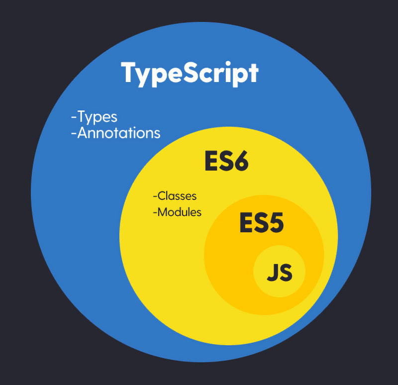

<h1 align='center'>Explore Basic Types of Typescript</h1>

## Topics

1. Intro to typescript technocrat mission
2. Introduction to typescript
3. install typescript and node version manager
4. Basic data types
5. Object , Optional and Literal Types
6. Function in typescript
7. Spread and Rest Operator
8. Destructuring in typescript
9. Type alias in typescript
10. Union and Intersection types
11. Ternary, optional chaining & nullish coalescing operator
12. Never, unknown and nullable type

## Table of Contents

- [What is TypeScript ?](#what-is-typescript-)
  - [Lacking in JavaScript](#lacking-in-javascript)
  - [Benefits of Using TypeScript](#benefits-of-using-typescript)
  - [Drawbacks of Using TypeScript](#drawbacks-of-using-typescript)
- [Basic data types](#basic-data-types)
  - [Primitive:](#primitive)
  - [Not Primitive types:](#not-primitive-types)
  - [JS Types in Ts:](#js-types-in-ts)
  - [TS own Types](#ts-own-types)
- [Object , Optional and Literal Types](#object--optional-and-literal-types)
- [Function in typescript](#function-in-typescript)
  - [Function Types](#function-types)
- [Spread and Rest Operator](#spread-and-rest-operator)
- [Destructuring In Typescript](#destructuring-in-typescript)
- [Type Alias In Typescript](#type-alias-in-typescript)
- [Union And Intersection Types](#union-and-intersection-types)
  - [Union type ( | )](#union-type---)
  - [Intersection type ( \& )](#intersection-type---)
- [Ternary, Optional Chaining \& Nullish Coalescing Operator](#ternary-optional-chaining--nullish-coalescing-operator)
  - [Ternary operator ( ? )](#ternary-operator---)
  - [Nullish Coalescing Operator](#nullish-coalescing-operator)
  - [Optional Chaining](#optional-chaining)
- [Never, Unknown And Nullable Type](#never-unknown-and-nullable-type)
  - [Unknown type](#unknown-type)
  - [Never Type](#never-type)

# What is TypeScript ?

TypeScript is an Object-Oriented Programming Languages that is build on top of JavaScript with Extra Features.

<p align="center">
  <b>JavaScript Extends TypeScript</b>
</p>

<p align="center" >
  
</p>

### Lacking in JavaScript

When working in a large Application with multiple Developers.

- Very difficult to maintain large codebase
- Hard to find bugs
- Catch errors only in runtime
- JavaScript is Dynamically typed language

<p align="center">
  <b>TypeScript code can be transpiled into older version of JavaScript</b>
</p>

### Benefits of Using TypeScript

- Support older Browser
- Type safety
- increase your productivity
- less bugs and less testing

### Drawbacks of Using TypeScript

- Type complexities
- Limited library support
- Over Engineering
- Migration Challenges

# Basic data types

### Primitive:

- number
- string
- boolean
- null
- undefined
- symbol

### Not Primitive types:

- Array
- Tuple
- Object

### JS Types in Ts:

- Number
- String
- Boolean
- Null
- Undefined
- Object
- Symbol

### TS own Types

- Interface
- Void
- Array
- Tuple
- Enum
- Union
- Intersection

```ts
// Basic Data Types

// string
let firstName: string = "noyon";

// number
let roll: number = 9;

// boolean
let isAdmin: boolean = true;

// undefined
let x: undefined = undefined;

// null
let y: null = null;

// any
let d: any; // If we use any that means we don't use the power of typescript.
// we need to avoid to use the 'any' type in TypeScript

// array
let friends: string[] = ["nadim", "shakil"];
// friends.push(3);
// Argument of type 'number' is not assignable to parameter of type 'string'.

let rollList: number[] = [23, 34];
// rollList.push("asif");
// Argument of type 'string' is not assignable to parameter of type 'number'.

// tuple --> array --> order --> type of values
let coordinates: [number, number] = [1, 5];

let ageName: [number, string, boolean] = [50, "Mr.X", true];
ageName[0] = 55;
```

# Object , Optional and Literal Types

```ts
// Reference Type --> Object

const user: {
  firstName: string;
  middleName?: string; // optional type
  lastName: string;
  isMarried: boolean;
  // company: "Programming Hero";
  // type -> literal type. we can also specify it by readonly
  readonly company: string;
} = {
  firstName: "Noyon",
  middleName: "",
  lastName: "Rahman",
  isMarried: false,
  company: "Programming Hero",
};

user.company = "ph";
// Cannot assign to 'company' because it is a read-only property.
```

# Function in typescript

### Function Types

- Normal Function
- Arrow Function

```ts
// Learning Functions
/**
 * Functions types
 * - Normal Function
 * - Arrow Function
 */

// normal function
function add(number1: number, number2: number): number {
  return number1 + number2;
}

add(3, "5");
// Argument of type 'string' is not assignable to parameter of type 'number'.
add(3, 5);

// arrow function
const addByArrow = (num1: number, num2: number): number => num1 + num2;
addByArrow(3, 5);

// object --> function --> method
const poorUser = {
  name: "Noyon",
  balance: 0,
  addBalance(newBalance: number): number {
    return this.balance + newBalance;
  },
};

// callback function
const arr: number[] = [1, 2, 3, 4, 5];
const newArray: number[] = arr.map((num: number): number => num * num);
```

# Spread and Rest Operator

```ts
//  Spread and Rest Operator

// spread operator
const bros1: string[] = ["nadim", "shakil", "asif"];
const bros2: string[] = ["mahfuj", "asraf", "sabit"];

bros1.push(...bros2);

// const allBros: string[] = [...bros, ...bros2];

const mentors1 = {
  typescript: "Mezba",
  redux: "Mir",
  dbms: "Mizan",
};

const mentors2 = {
  prisma: "Firoz",
  next: "Tanmoy",
  cloud: "Nahid",
};

const allMentors = {
  ...mentors1,
  mentors2,
};

// rest operator

// without rest operator
const greetFriends1 = (friend1: string, friend2: string, friend3: string) => {
  console.log(`Hi ${friend1}`);
  console.log(`Hi ${friend2}`);
  console.log(`Hi ${friend3}`);
};

greetFriends1("Nadim", "Shakil", "Asif");

// with rest operator
const greetFriends2 = (...friends: string[]) => {
  friends.forEach((friend) => {
    console.log(`Hi ${friend}`);
  });
};
```

# Destructuring In Typescript

```ts
// Destructuring In Typescript
const user1 = {
  id: 125,
  name: {
    firstName: "Noyon",
    middleName: "",
    lastName: "Rahman",
  },
  contactNo: "+8801700000000",
  address: "Bangladesh",
};

// object destructuring
const {
  contactNo,
  name: { firstName: fName, middleName, lastName },
  // name aliases
} = user1;

// array destructuring
const friendsList = ["nadim", "shakil", "asif", "mahfuj"];
const [firstFriend, secondFriend, ...restFriends] = friends;
// we can also use rest operator in array destructuring
console.log(firstFriend);
console.log(secondFriend);
```

# Type Alias In Typescript

```ts
// Type Alias In Typescript

type Student = {
  name: string;
  age: number;
  gender: string;
  contactNo?: string;
  address: string;
};

const student1: Student = {
  name: "Noyon",
  age: 21,
  gender: "Male",
  contactNo: "+8801700000000",
  address: "Bangladesh",
};

const student2: Student = {
  name: "Nadim",
  age: 20,
  gender: "Male",
  address: "Bangladesh",
};

type Username = string;
type IsAdmin = boolean;
const userName: Username = "Noyon";
const admin: IsAdmin = true;

// type aliases for functions
type AddFunc = (num1: number, num2: number) => number;
const addFun: AddFunc = (num1, num2) => num1 + num2;
```

# Union And Intersection Types

### Union type ( | )

```ts
type FrontendDeveloper = "fakibuzDeveloper" | "juniorDeveloper";
type FullStackDeveloper = "frontendDeveloper" | "fullstackDeveloper";
type Developer = FrontendDeveloper | FullStackDeveloper;

const newDeveloper: FrontendDeveloper = "juniorDeveloper";

type User = {
  name: string;
  email?: string;
  gender: "male" | "female";
  bloodGroup: "A+" | "AB+" | "B+" | "O+" | "O-";
};

const newUser: User = {
  name: "Noyon",
  gender: "male",
  bloodGroup: "A+",
};
```

### Intersection type ( & )

```ts
type FrontendDeveloper = {
  skills: string[];
  designation1: "Front-end Developer";
};

type BackendDeveloper = {
  skills: string[];
  designation2: "Back-end Developer";
};

type FullStackDeveloper = FrontendDeveloper & BackendDeveloper;

const fullstackDeveloper: FullStackDeveloper = {
  skills: ["JavaScript", "ReactJS", "ExpressJS"],
  designation1: "Front-end Developer",
  designation2: "Back-end Developer",
};
```

# Ternary, Optional Chaining & Nullish Coalescing Operator

### Ternary operator ( ? )

```ts
// Ternary, Optional Chaining & Nullish Coalescing Operator
const age: number = 18;

if (age >= 18) {
  console.log("adult");
} else {
  console.log("not adult");
}

// ternary operator
const isAdult: string = age >= 18 ? "adult" : "not adult";
console.log(isAdult);
```

### Nullish Coalescing Operator

```ts
// nullish coalescing operator
// null / undefined -> when we make decision based on this
const isAuthenticated = null;
const result1 = isAuthenticated ?? "Guest"; // only work in null / undefined
const result2 = isAuthenticated ? isAuthenticated : "Guest";
console.log({ result1, result2 });
```

### Optional Chaining

```ts
// optional chaining operator
type User = {
  name: string;
  address: {
    city: string;
    road: string;
    presetAddress: string;
    permanentAddress?: string;
  };
};

const user3: User = {
  name: "Noyon",
  address: {
    city: "Gazipur",
    road: "Awesome Road",
    presetAddress: "Gazipur City",
  },
};

const permanentAddress: string =
  user3?.address?.permanentAddress ?? "No Permanent Address";
console.log({ permanentAddress });
```

# Never, Unknown And Nullable Type

### Unknown type

```ts
const searchName = (value: string) => {
  if (value) {
    console.log("Searching....");
  } else {
    console.log("There is nothing to search");
  }
};

// Unknown type
const getSpeedInMeterPerSecond = (value: unknown) => {
  if (typeof value === "number") {
    const convertedSpeed = ((value * 1000) / 3600).toFixed(2);
    console.log(`The speed is ${convertedSpeed} ms^-1`);
  } else if (typeof value === "string") {
    const [result, _unit] = value.split(" "); // array destructuring
    const convertedSpeed = ((parseInt(result) * 1000) / 3600).toFixed(2);
    console.log(`The speed is ${convertedSpeed} ms^-1`);
  } else {
    console.log("Wrong input!");
  }
};

getSpeedInMeterPerSecond("1000 kmh^-1");
getSpeedInMeterPerSecond(null);
```

### Never Type

```ts
// never type
const throwError = (msg: string): never => {
  throw new Error(msg);
};

throwError("Muslik se error hogaya!");
```
